## Steps to build a MongoDB cluster

> After signing in go to the dashboard and follow these steps

1. Click on **New Project** button.
   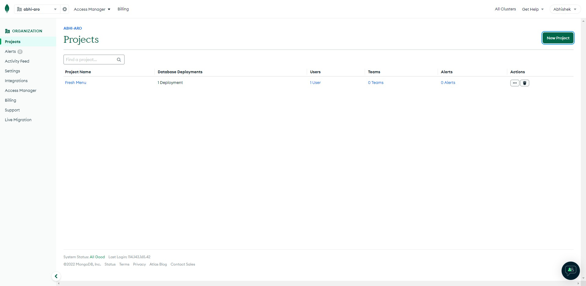

1. Name Your Project and click on **Next** button.
   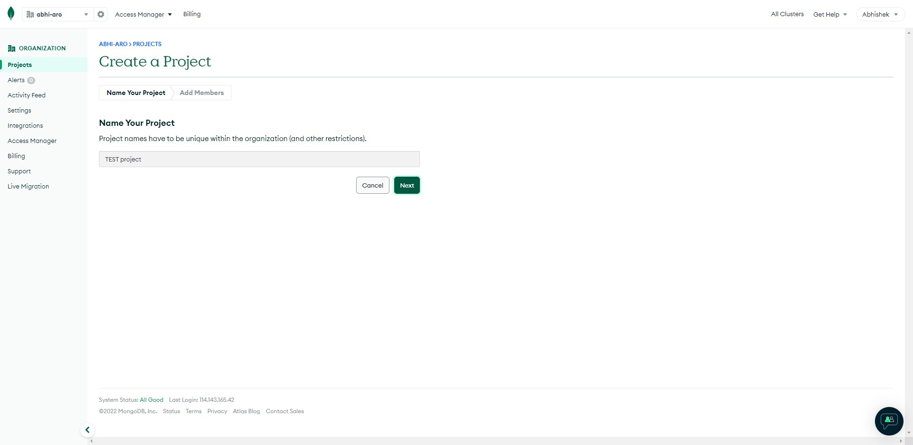

1. Add members (if working with a team) then click on **Create Project** button.
   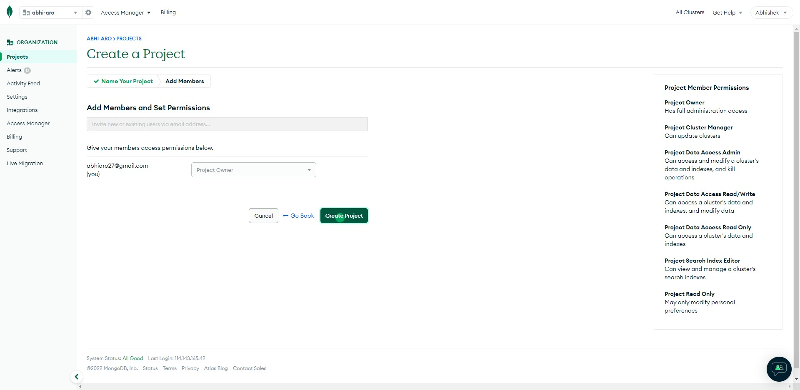

1. Click on **Build a Database** button.
   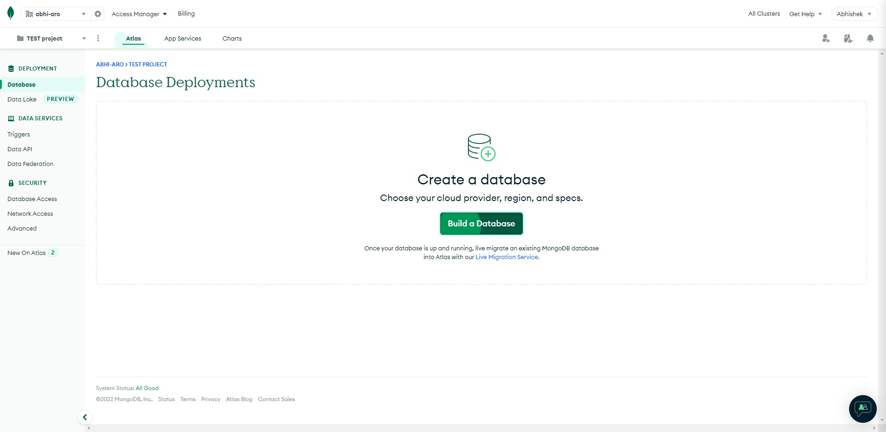

1. Choose deployment option based on requirements and click on **Create** button.
   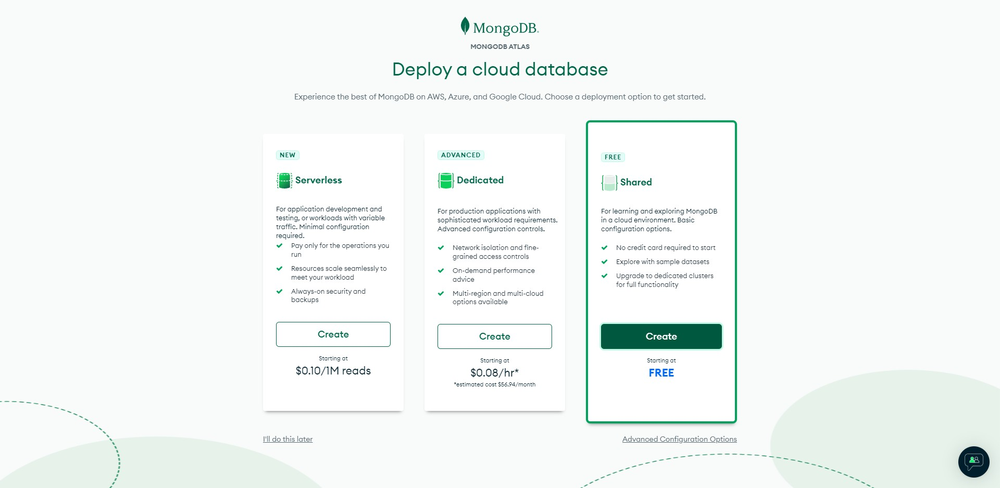

1. Choose cloud provider and Region.
   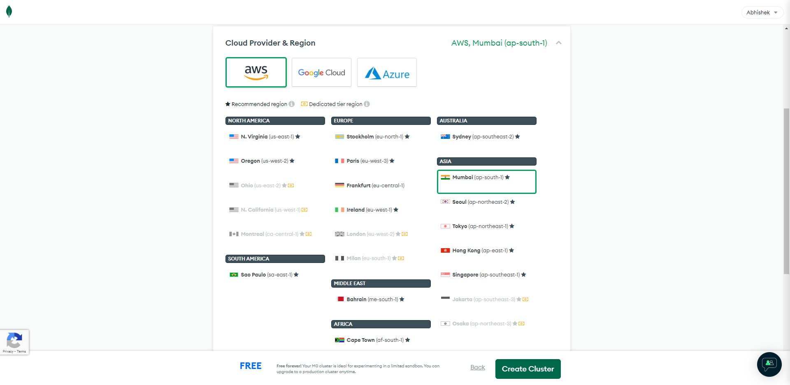

1. Default Cluster name is **Cluster0**, I recommend you change it to something else.
   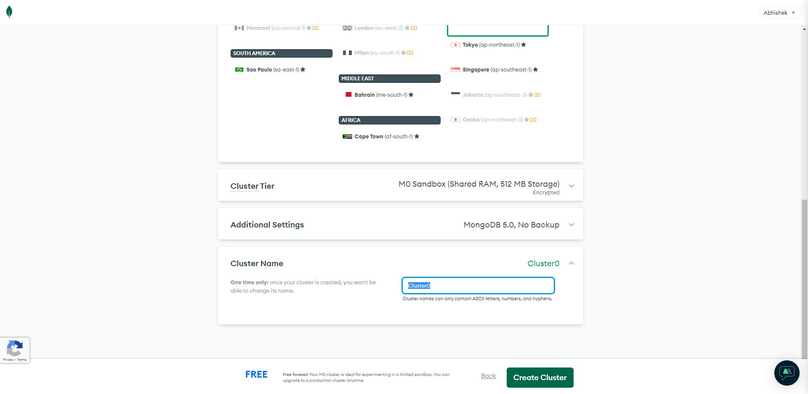

1. Choose a cluster name then click on **Create Cluster** button.
   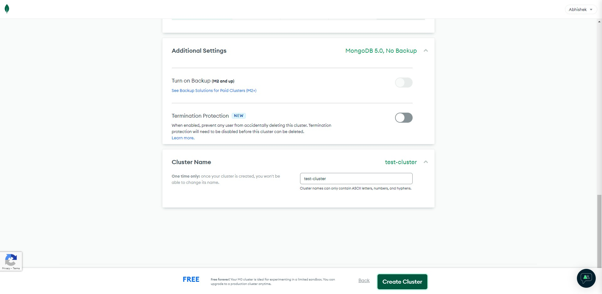

1. Choose a method of Authentication and click on **Create User**
   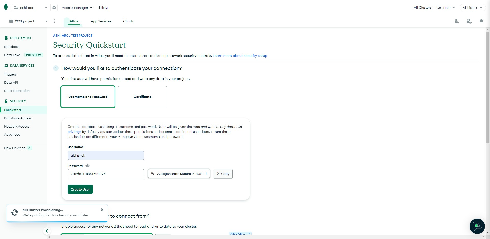

1. Choose where you will be connecting from (use local environment for your projects)
   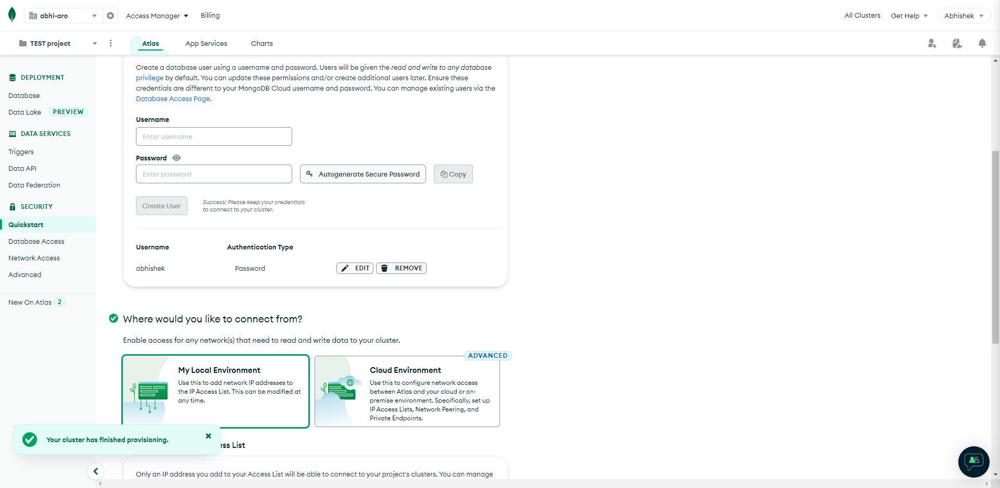

1. Add ip of your devices from where you'll be accessing this cluster

   - you can change this to global after creating this cluster.

   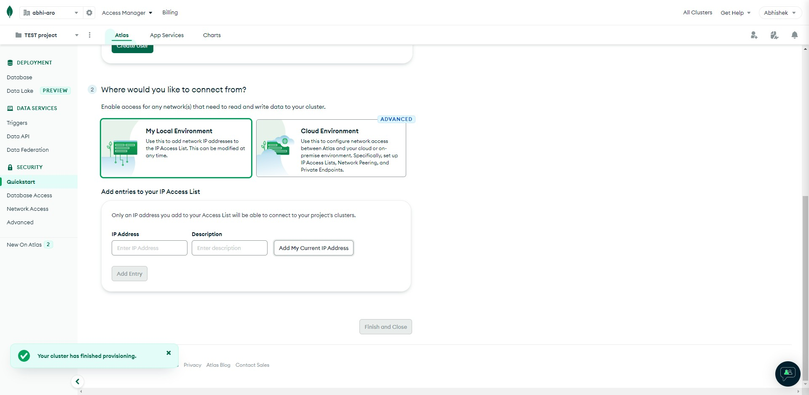

1. Click on **Add My Current IP Address** button
   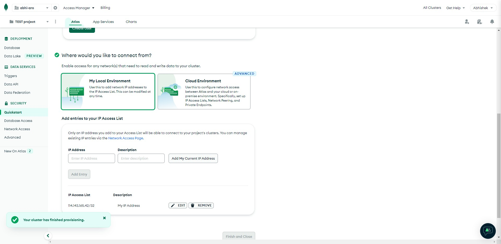

1. Click on **Finish and Close** button
   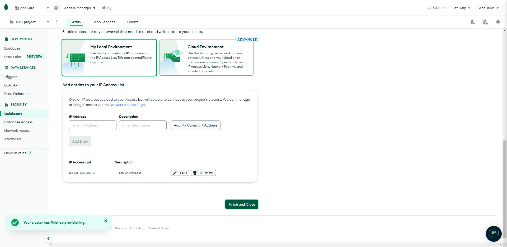

1. Click on **Go to Databases** button
   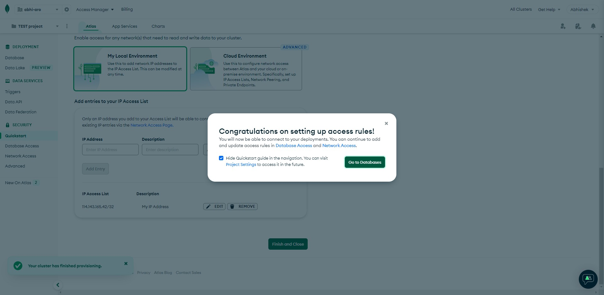

Congratulations 🥳🎉🎉🎉 your Cluster of Databases is Ready.

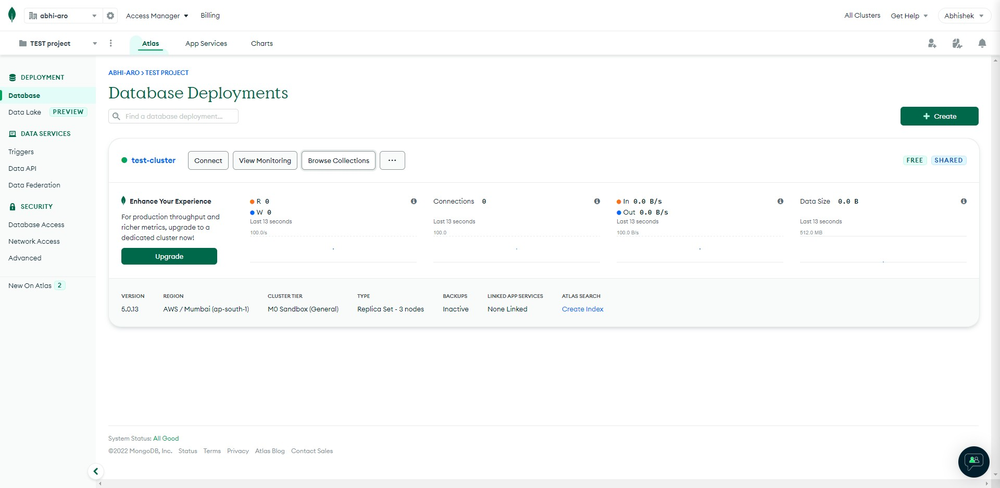
